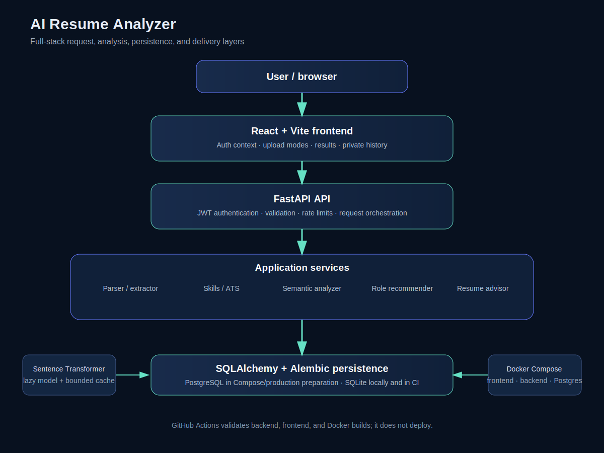

# AI Resume Analyzer

An intelligent full-stack platform for resume parsing, ATS-style analysis,
job-description matching, role recommendations, and actionable career feedback.

[](https://www.python.org/)
[](https://fastapi.tiangolo.com/)
[](https://react.dev/)
[](https://www.postgresql.org/)
[](https://docs.docker.com/compose/)
[](.github/workflows/ci.yml)
[](LICENSE)

AI Resume Analyzer helps candidates understand how a PDF or DOCX resume aligns
with a job description or technical role profiles. It combines deterministic
extraction and ATS-style signals with TF-IDF and Sentence Transformer
similarity, then presents explainable scores, missing skills, role
recommendations, and rule-based resume feedback. Results are guidance—not
official employer ATS decisions or hiring predictions.

## Contents

- [Features](#features)
- [Application modes](#application-modes)
- [Screenshots](#screenshots)
- [Architecture](#architecture)
- [Technology stack](#technology-stack)
- [Local development](#local-development)
- [Docker](#docker)
- [Testing](#testing)
- [Security and privacy](#security-and-privacy)
- [Limitations and roadmap](#limitations-and-roadmap)
- [Developer](#developer)

## Features

### Resume understanding

- PDF and DOCX parsing, including DOCX tables.
- File signature, container, size, and empty-upload validation.
- Structured extraction of contact fields, links, sections, and skills.

### Analysis and recommendations

- Resume-to-job-description skill matching and gap identification.
- Explainable ATS-style scoring with bounded component results.
- TF-IDF, combined similarity, and Sentence Transformer semantic analysis.
- Technical role recommendations from repository-maintained role profiles.
- Matched/missing skills, score components, strengths, and improvement areas.
- Deterministic feedback for sections, bullets, action verbs, quantification,
  repetition, readability, contact presentation, and bounded evidence.

### Accounts and operations

- Argon2 password hashing and JWT authentication.
- Authenticated, user-scoped analysis history with open and delete actions.
- SQLite for local development/CI and PostgreSQL for Compose/deployment prep.
- Docker Compose for frontend, backend, and PostgreSQL.
- GitHub Actions CI for backend, frontend, and Docker validation.
- Rate limiting, environment-based secrets, database health checks, upload
  hardening, and privacy-conscious logging.

## Application modes

- **Analyze** — upload a resume and job description for skills, similarity,
  ATS-style, role, and improvement results.
- **Parse** — extract text and structured candidate information.
- **Roles** — rank predefined technical roles using exact skills and semantic
  similarity.
- **Improve** — review deterministic writing, structure, and feedback signals.

## Screenshots

No application screenshots are committed yet. Follow
[docs/SCREENSHOTS.md](docs/SCREENSHOTS.md), use fictional candidate data, and
add approved PNGs under `docs/images/application/`. This README intentionally
contains no broken or fabricated image references.

## Architecture



The React/Vite frontend sends authenticated requests to FastAPI. The backend
validates files, extracts structured information, compares skills and content,
optionally runs the Sentence Transformer, calculates ATS signals, ranks roles,
generates advisor feedback, and persists reports through SQLAlchemy. SQLite and
PostgreSQL are supported; Alembic manages migrations.

See the [architecture guide](docs/ARCHITECTURE.md),
[analysis workflow](docs/images/diagrams/analysis-workflow.svg), and
[authentication flow](docs/images/diagrams/authentication-flow.svg).

## Technology stack

| Area | Verified technologies |
| --- | --- |
| Frontend | React, Vite, Axios, CSS, Nginx |
| Backend | Python, FastAPI, Uvicorn, Pydantic |
| AI/NLP | Sentence Transformers, PyTorch, NumPy, scikit-learn, PyMuPDF, python-docx |
| Database | SQLAlchemy, Alembic, SQLite, PostgreSQL, Psycopg 3 |
| Authentication | PyJWT, Argon2 via `pwdlib` |
| Testing | pytest, pytest-cov, Vitest, React Testing Library |
| DevOps | Docker Compose, GitHub Actions, Buildx |
| Deployment preparation | Railway configuration/runbook; no deployment claimed |

## Repository structure

```text
backend/app/                 FastAPI routes and application services
backend/data/                Role profiles and skill definitions
backend/migrations/          Alembic environment and versions
backend/tests/               pytest suite
backend/benchmarks/          Synthetic analysis benchmark utility
frontend/src/components/     Forms, results, history, and branding
frontend/src/context/        Authentication context
frontend/src/services/       Axios API client
docs/                        Architecture, API, demo, screenshots, portfolio
scripts/                     Optional deployment smoke-test utility
compose.yaml                 Local Docker Compose infrastructure
.github/workflows/           CI and manually triggered image workflow
```

## Local development

### Windows PowerShell backend

```powershell
cd E:\AI-Resume-Analyzer\backend
python -m venv .venv
.\.venv\Scripts\Activate.ps1
python -m pip install --upgrade pip
python -m pip install -r requirements-dev.txt
Copy-Item .env.example .env
python -c "import secrets; print(secrets.token_urlsafe(64))"
python -m alembic upgrade head
python -m uvicorn app.main:app --reload
```

Use `DATABASE_URL=sqlite:///./resume_analyzer.db` for local SQLite, or a
PostgreSQL URL. Keep `.env` untracked. The API is at
`http://127.0.0.1:8000`, Swagger at `http://127.0.0.1:8000/docs`, and health at
`http://127.0.0.1:8000/health`.

### Windows PowerShell frontend

```powershell
cd E:\AI-Resume-Analyzer\frontend
npm ci
Copy-Item .env.example .env
npm run dev
```

Vite serves `http://127.0.0.1:5173`. Configure `VITE_API_BASE_URL` in the
frontend environment file when the API is elsewhere. Never commit real `.env`
files.

## Docker

Copy `.env.docker.example` to `.env.docker`, replace placeholders locally, and
keep that file untracked:

```powershell
Copy-Item .env.docker.example .env.docker
docker compose --env-file .env.docker up --build
docker compose --env-file .env.docker ps
docker compose --env-file .env.docker logs -f
docker compose --env-file .env.docker down
```

Compose runs PostgreSQL, FastAPI, and Nginx. The frontend is at
`http://127.0.0.1:3000`; the backend is at `http://127.0.0.1:8000`. This is
local infrastructure, not a claim of public deployment.

## Environment variables

Use [`backend/.env.example`](backend/.env.example),
[`backend/.env.production.example`](backend/.env.production.example),
[`frontend/.env.example`](frontend/.env.example), and
[`.env.docker.example`](.env.docker.example). Important variables include
`DATABASE_URL`, `JWT_SECRET_KEY`, `JWT_ALGORITHM`,
`ACCESS_TOKEN_EXPIRE_MINUTES`, `CORS_ORIGINS`, `MAXIMUM_FILE_SIZE_MB`, rate
limits, `SEMANTIC_MODEL_NAME`, `SEMANTIC_MODEL_LOCAL_ONLY`,
`SEMANTIC_RESULT_CACHE_SIZE`, `LOG_LEVEL`, and `VITE_API_BASE_URL`.

## Testing

From `backend`:

```powershell
python -m pytest -m "not semantic"
python -m pytest --cov=app --cov-report=term-missing
python -m pytest -m semantic  # only when the configured model is available
```

From `frontend`:

```powershell
npm run lint
npm run test:run
npm run build
```

Repository/Docker validation:

```powershell
git diff --check
docker compose --env-file .env.docker -f compose.yaml config
docker compose --env-file .env.docker -f compose.yaml build
```

The synthetic benchmark utility is `backend/benchmarks/benchmark_analysis.py`.
Its timings are environment-specific observations, not universal claims.

## API overview

See [docs/API_OVERVIEW.md](docs/API_OVERVIEW.md) for verified routes and
authentication requirements. Swagger is available at
`http://127.0.0.1:8000/docs`.

## Security and privacy

- Argon2 password hashing and JWT protection cover analysis and history routes.
- History reads/deletes are scoped to the authenticated user.
- Upload signatures, containers, extensions, size, and empty content are checked.
- In-process rate limiting protects registration, login, and resume operations.
- CORS, database URLs, JWT keys, and model settings use environment variables.
- Logs avoid resume contents and credentials; feedback evidence is bounded and
  redacts common contact/address patterns.

Do not upload highly sensitive personal documents to an untrusted deployment.
`localStorage` token storage is a known browser-side trade-off, not a claim of
complete client-side security.

## Performance engineering

Implemented work includes lazy thread-safe model initialization, model reuse,
static role embedding reuse, bounded process-local embedding caching, reduced
repeated preprocessing, threadpool isolation for blocking semantic work,
duplicate frontend-submission prevention, lightweight timing, and an indexed
history migration. No unverified numerical improvement is claimed.

## Limitations and roadmap

### Completed

PDF/DOCX parsing, structured extraction, ATS-style and semantic guidance,
explainable roles, deterministic feedback, authentication, private history,
SQLite/PostgreSQL support, Compose, CI validation, hardening, performance work,
and developer branding are implemented.

### Planned

OCR for image-only resumes, stronger PII detection, distributed rate limiting,
measured production observability, and richer role-profile maintenance.

### Optional future enhancements

Shared model infrastructure, broader accessibility review, additional document
formats, and a carefully scoped secure token architecture could be evaluated.

Scores are educational and advisory. They are not official ATS decisions,
recruiter validation, hiring probabilities, or guaranteed outcomes. Automatic
generative rewriting and public cloud deployment are not claimed.

## Developer

**Anshuman Pattanayak** — AI & ML Expert, Artificial Intelligence Specialist

Centurion University BBSR · B.Tech 4th Year

- GitHub: <https://github.com/ItsAnshumanPattanayak>
- Email: <mailto:anshumanpattanayak931@gmail.com>

## License and disclaimer

This project is distributed under [LICENSE](LICENSE). Analysis results are
educational and advisory, not guaranteed hiring outcomes or official ATS
decisions. Verify suggestions and provide only truthful resume information.
